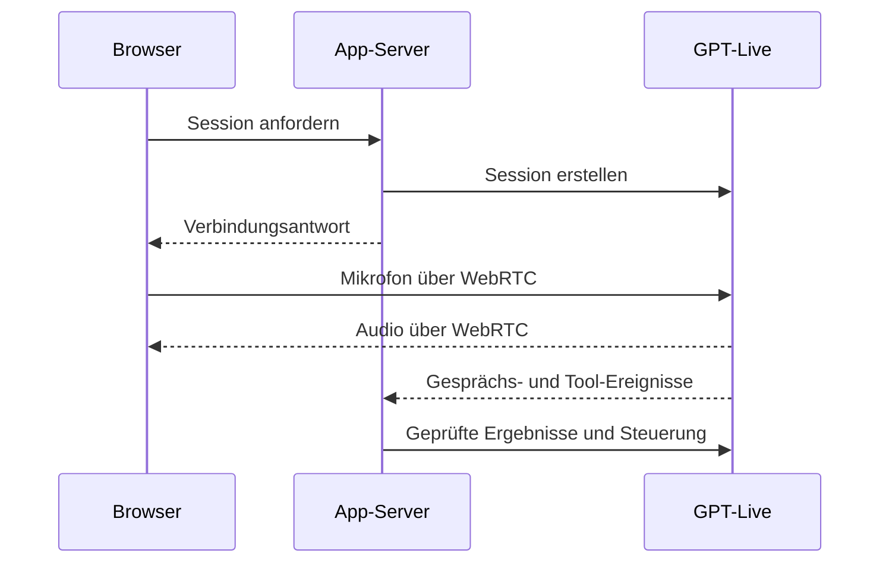

# audio-flow

Status: statisch aus Referenzcode abgeleitet; Core noch nicht migriert.

Audioerzeugung, tatsächliches Abspielen und technische Aktionsausführung sind getrennt nachzuweisen. Quellen S03/S04/S07/S14. Keine Aussage über derzeitige Live-Verfügbarkeit.
