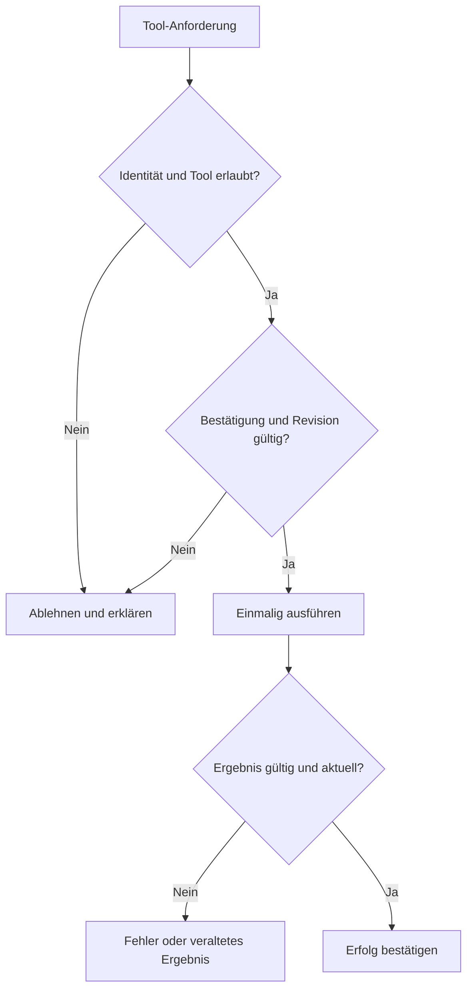

# tool-flow

Status: geplanter Vertrag, nicht implementiert.

Audioerzeugung, tatsächliches Abspielen und technische Aktionsausführung sind getrennt nachzuweisen. Quellen S03/S04/S07/S14. Keine Aussage über derzeitige Live-Verfügbarkeit.
